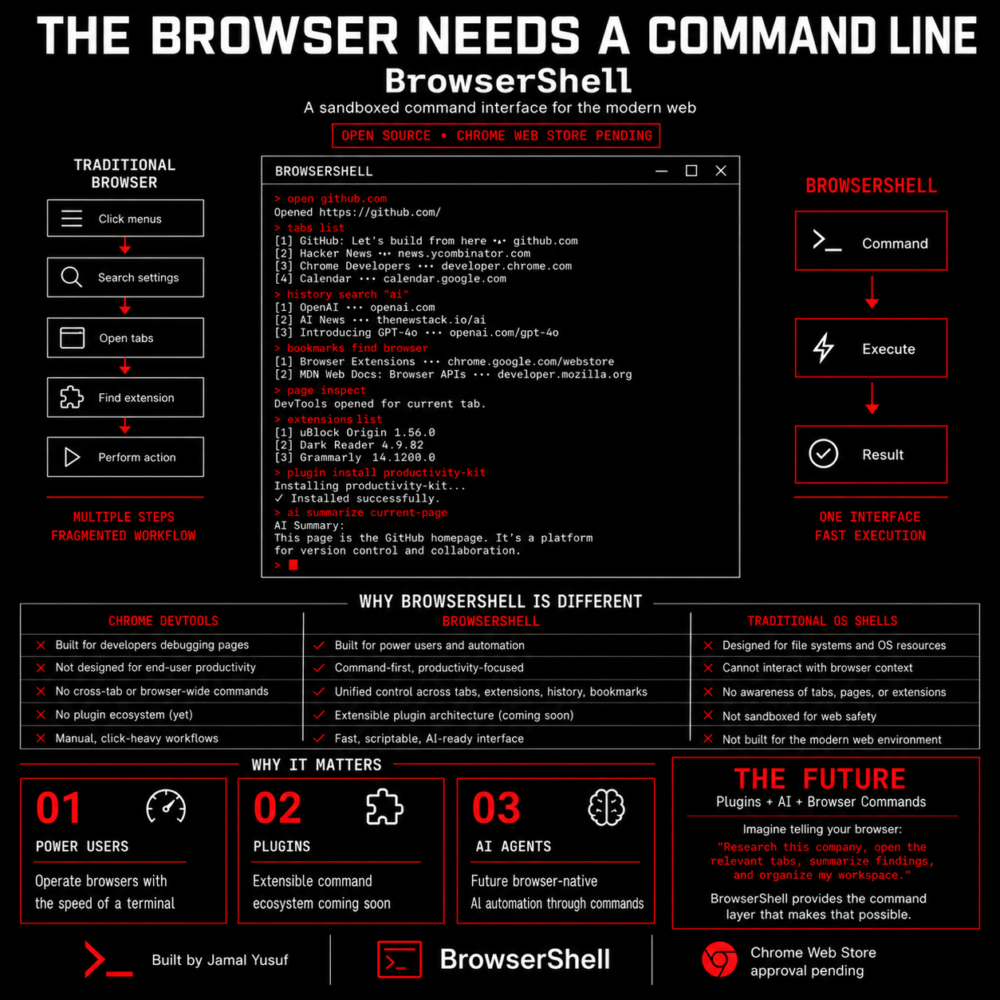

# BrowserShell

[](LICENSE)
[](public/manifest.json)
[](tsconfig.json)

**A shell for your browser** — tabs, bookmarks, history, downloads, and page actions as terminal commands.

**Website:** [jamalyusuf.github.io/BrowserShell](https://jamalyusuf.github.io/BrowserShell/)

BrowserShell is a Chrome extension that overlays a Quake-style terminal on any page. Manage tabs, bookmarks, workspaces, and page content with keyboard-driven commands — plus Vimium-style global hotkeys when the terminal is closed.




---

## Features

- **Quake-style overlay** — press `` ` `` (configurable) to toggle a terminal over the current page
- **100+ commands** — navigation, tabs, windows, bookmarks, history, workspaces, page interaction, dev tools, privacy
- **Built-in editor** — `edit /notes/file.md` — arrow keys, type to edit, Ctrl+S to save
- **Virtual filesystem** — `ls`, `cd`, `cat` on `/tabs`, `/bookmarks`, `/notes`, `/config/rc`, …
- **Multi-window layouts** — `layout side-by-side`, `split vertical`, `workspace save/load`
- **Vimium-style hotkeys** — link hints, scroll, omnibar, tab switching (configurable in `~/.browsershellrc`)
- **Pipes & shell builtins** — `tabs | grep youtube`, aliases, bang expansions (`!gh query`)
- **Self-documenting** — `help`, `man <cmd>`, tab completion
- **Options page** — themes, fonts, prompt, hotkeys, command explorer

### Example commands

```bash
tabs                          # list open tabs
go github.com                 # navigate active tab
edit /config/rc               # edit config in terminal
touch /notes/todo.md && edit /notes/todo.md
layout side-by-side           # tile two windows
workspace save research       # save multi-window layout
history search react
links                         # list links on the current page
forget --dry-run              # preview site data deletion
```

Run `help` or see [docs/COMMANDS.md](docs/COMMANDS.md) for the full reference.

---

## Quick start

### Requirements

- [Node.js](https://nodejs.org/) 20+
- Google Chrome or Chromium (Manifest V3)

### Build & load

```bash
git clone https://github.com/jamalyusuf/browsershell.git
cd browsershell
npm install
npm run build
```

1. Open `chrome://extensions`
2. Enable **Developer mode**
3. **Load unpacked** → select the `dist/` folder

### Usage

| Action | Default |
|--------|---------|
| Toggle overlay | `` ` `` (backtick) |
| Toggle overlay (shortcut) | `Ctrl+Shift+K` / `Cmd+Shift+K` |
| Open editor | `edit /notes/file.md` |
| Save in editor | `Ctrl+S` or `:w` |
| Tab completion | `Tab` |
| Command history | `↑` / `↓` |
| Options | `config` or extension icon |

Assign shortcuts at `chrome://extensions/shortcuts`.

---

## Development

```bash
npm run dev          # watch build
npm test             # test suite
npm run typecheck    # TypeScript
npm run generate-docs  # regenerate docs/COMMANDS.md
npm run build:desktop  # build + sync to local load folder (if configured)
```

### Project layout

```
src/
├── background/      # Service worker
├── chrome/          # Mockable Chrome API wrapper
├── commands/        # Command handlers
├── content/         # Overlay + global hotkeys
├── overlay/         # Terminal UI shell
├── options/         # Settings page
├── shell/           # Parser, executor, completion
├── terminal/        # TerminalHost + built-in editor
└── vfs/             # Virtual filesystem providers
```

See [docs/ARCHITECTURE.md](docs/ARCHITECTURE.md).

---

## Permissions

Every permission maps to specific commands — nothing is used for tracking.

| Permission | Why |
|------------|-----|
| `tabs`, `activeTab`, `sessions` | Tab/window management |
| `bookmarks`, `history` | Bookmark and history commands |
| `downloads` | Download listing and reveal |
| `cookies`, `browsingData`, `contentSettings` | Privacy commands |
| `management` | `extensions` command |
| `scripting` | Page interaction commands |
| `storage` | Config, notes, workspaces |
| `notifications` | `notify` command |
| `system.display` | Window layout tiling |
| `<all_urls>` | Overlay and page scripts |

Full rationale: [docs/PERMISSIONS.md](docs/PERMISSIONS.md)

---

## Chrome Web Store

Ready for packaging from `dist/` after `npm run build`. Privacy policy and permission justifications are on the [project website](https://jamalyusuf.github.io/BrowserShell/legal/permissions/).

---

## Contributing

See [CONTRIBUTING.md](CONTRIBUTING.md).

## License

[MIT](LICENSE) © 2026 Jamal Yusuf